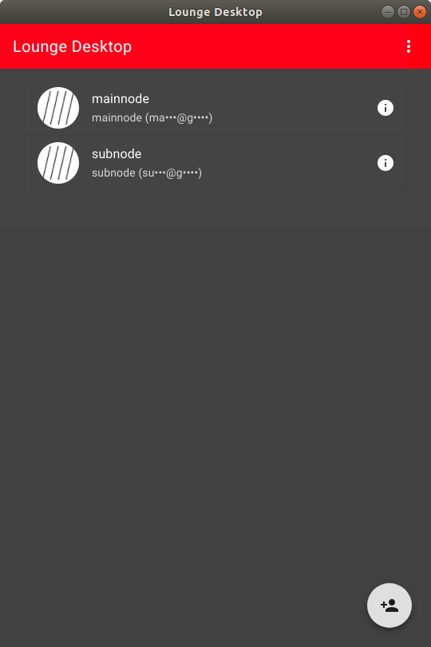
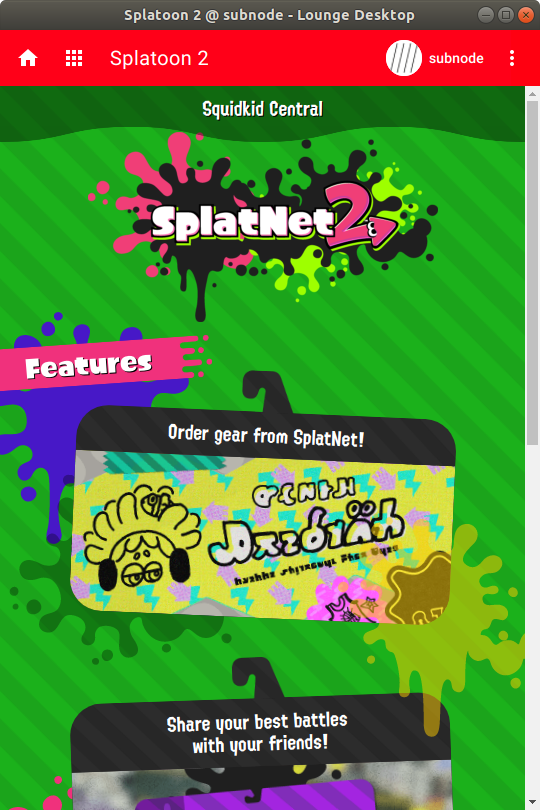
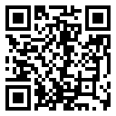

# Lounge Desktop

Use Nintendo Switch Online app on your PC.

## Download

See [releases](../../releases) for the binary distributions.

## Features

- Cross-platform  
  works on Windows and Linux
- Multiple accounts  
  up to 3 accounts supported

## Known limitations

- macOS is not supported yet (I don't have a Mac computer)
- Voice chat is not supported yet

## Known issues

See [issues](../../issues).

Please [open an issue](../../issues/new) if you find a bug.

## Screenshots

## Donation

Donate BTC:
[16AuWua5zoNNvkKWw1RepfKFV2g2K1w2cJ](bitcoin:16AuWua5zoNNvkKWw1RepfKFV2g2K1w2cJ)

## Notes

Nintendo Switch is a trademark of Nintendo.
